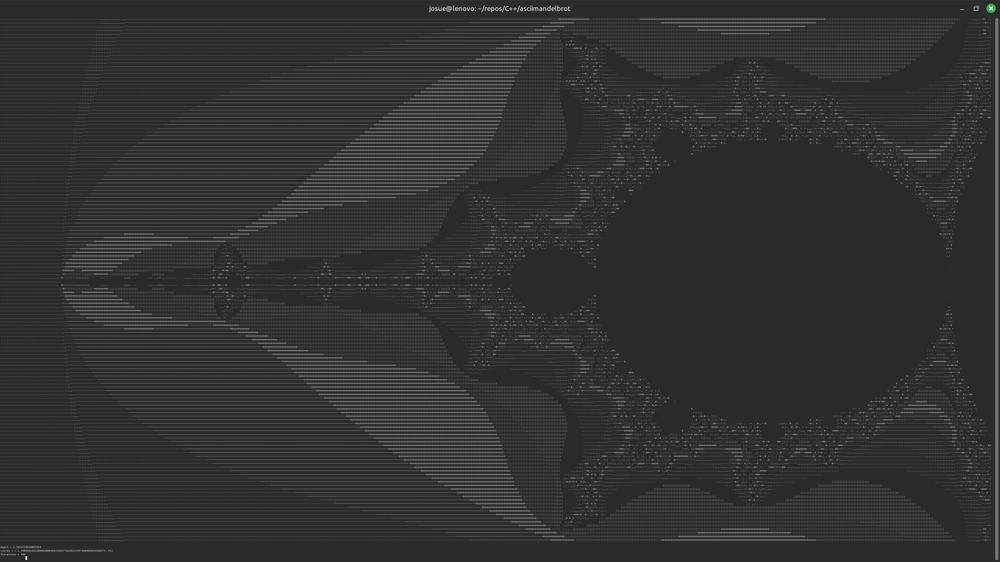

# AsciiMandelbrot

A Multithreaded Mandelbrot Explorer for your terminal. Written in C++ for Ncurses. 

The application makes use of GMP and MPFR libraries.



Application at max resolution on my system.

## Controls

| Key       | Control          |
|-----------|------------------|
| Enter     | Zoom in.         |
| Backspace | Zoom out.        |
| x         | Set Coordinates. |
| i         | Set iterations.  |
|Arrow Keys | Move camera.     |
| q or ESC  | Quit application.|

## Compile

To compile use:
```bash
g++ -Wall -std=c++23 -g asciimandelbrot.cpp -o ./asciimandelbrot -lgmp -lgmpxx -lmpfr -lncurses --fast-math -Werror 
```

### Notes

Started this in college and just decided to upload it after I fixed some things. Was kind of inspired by a1k0n's donut.c. It kinda lost it's shape after the optimizations, lol.

To do: 
- Need to do some sort of makefile/compilation process.